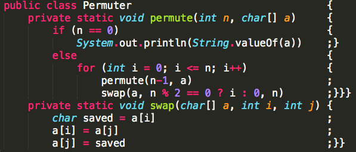
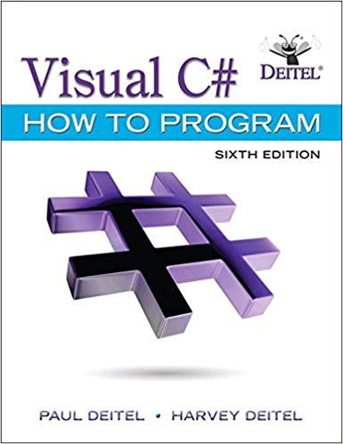

# Syllabus - CS 3280 OO Windows Applications in C# #

## Contents ##

- [Syllabus - CS 3280 OO Windows Applications in C#](#syllabus---cs-3280-oo-windows-applications-in-c)
  - [Contents](#contents)
  - [Instructor](#instructor)
  - [Course Objectives](#course-objectives)
  - [Book](#book)
  - [Software](#software)
  - [Students With Disabilities](#students-with-disabilities)
  - [Course Fee](#course-fee)
  - [Assignments](#assignments)
  - [Asking Questions](#asking-questions)
  - [Grading](#grading)
  - [CS Academic Cheating Policy](#cs-academic-cheating-policy)
  - [Extra Credit](#extra-credit)
  - [Schedule](#schedule)

## Instructor ##

My name is Ethan Brown. I'm a Weber State Alumni and a Software Engineer at local startup called TaxBit. I have experience working for big companies like Adobe and 3M as well. You can connect with me on linkedIn at [linkedin.com/in/ethan-brown-dev](https://www.linkedin.com/in/ethan-brown-dev/).

Even though I've done a lot of C#, I mostly work with python and bash in my day-to-day work. This just means I will need you all to call me out as I miss those semi-colons and curly braces during demos.

## Course Objectives ##

This is the official course description.

> This course is intended to teach students how to write Windows programs in C# using the .NET environment. The student will learn how to develop programs based on Windows Applications and the .NET Framework. They will also be introduced to APIs and MFC/AFX styles of Windows programming and to become familiar with various data sharing methods and .NET services.

My goal of this course will be for you to become better ENGINEERS. Not just a regurgitator of
facts and code snippets. I will be going over information about .NET so that you can pass your
Bachelor Assessment but for the most part I want this class to be about doing and less about note
taking.

## Book ##

The book is optional but it might be a useful reference. I will be using it to prepare
classroom lectures.

* Visual C# How to Program (6th Edition) (Deitel)

## Software ##

We will be using Visual Studio 2015+ and git. You may use the free community edition.
We will cover how to download it as well as git in class.

* Visual Studio 2015 or greater
* git
* VS Code (optional)
* WSL - Windows Subsystem for Linux (optional)

## Students With Disabilities ##

Any student requiring accommodations or services due to a disability must contact Services for
Students with Disabilities (SSD) in room 181 of the Student Services Center. SSD can also
arrange to provide course materials (including this syllabus) in alternative formats if necessary.

## Course Fee ##

Course fees for the Computer Science major are designed to cover the costs of lab equipment
maintenance and replacement including desktop and server computer systems and software;
consumable materials and supplies; and support for lab aides, student tutors, and online
instructional resources.

## Assignments ##

The course will be broken up into 2 parts. The first part will consist of smaller
assignments that will be focused on learning general concepts of C# and Windows Applications
The second part will be focused on a final group project.

* Assignments will be given with plenty of time to complete
* I will allow time in class to work
* They will require time outside of class especially as they increase in scope and difficulty
* Late assignments will incur a 10% penalty
* Anything turned in over a week late will incur a 50% penalty
* If you are struggling to keep up talk to me ASAP. Don't wait until after the assignment is due.
* You will use git to turn your code
* If you don't know git, don't panic! We will discuss how to use git in class and I will show you what you need know

## Asking Questions ##

Don't hesitate to ask questions. In this industry you have to be inquisitive, no matter how
"stupid" you think it is. The only thing that is stupid is making assumptions. Always clarify
and ask. There are 3 resources for asking questions.

1. In Class
2. Canvas Discussion Boards
3. direct email to me (only use this if it is a personal matter or urgent)

## Grading ##

    A = 93 - 100%
    A- = 90 - 92.99%
    B+ = 87 – 89.99%
    B = 83 – 86.99%
    B- = 80 – 82.99%
    C+ = 77 – 79.99%
    C = 73 – 76.99%
    C- = 70 – 72.99%
    D+ = 67 – 69.99%
    D = 63 – 66.99%
    D- = 60 – 62.99%
    E  = below 60%

## CS Academic Cheating Policy ##

CS policy dictates that any verifiable evidence of student academic cheating, as defined and determined by the instructor, will result in: 
1) an automatic failing grade for the class and 
2) a report to the Dean of Students that will include the student's name and a description of the student's dishonest conduct.

## Extra Credit ##

There will be opportunities for some extra credit. They involve helping me refine the course material. In order to keep materials fresh with minimal errors I will allow you to submit pull requests against it. I will explain how that works as we dive into using Git.

## Schedule ##

The Schedule is a **ROUGH** outline of what we will cover. I reserve the right to adjust for
the class needs. My goal would be to finish up the topics earlier to allow more time for
the final project. I will be your guide through this and we will speed up and slow down as
needed.

| Week | Days                    | Chapter                                              |
| ---- | ----------------------- | :--------------------------------------------------- |
| 1    | May 6th, 8th            | Course Introduction and Git, Install Software        |
| 2    | May 13th, 15th          | Visual Studio, Intro to .NET/C#, Classes / Objects        |
| 3    | May 20th, 22nd          | Methods and Control Structures                       |
| 4    | May 27th NO CLASS, 29th | GUI with WPF, Arrays, Strings, Generics, Collections |
| 5    | Jun 3rd, 5th            | Classes / Objects and Inheritance / Polymorphism     |
| 6    | Jun 10th, 12th          | Midterm Review and Midterm                           |
| 7    | Jun 17th, 19th          | Exception Handling and GUI Concepts                  |
| 8    | Jun 24th, 26th          | GUI Concepts and XML                                 |
| 9    | Jul 1st, 3rd            | Databases, Multithreading                            |
| 10   | Jul 8th, 10th           | Files and Streams, Syntatic Sugar, LINQ              |
| 11   | Jul 15th, 17th          | Lambdas, Anonymous Methods, Advanced WPF             |
| 12   | Jul 22nd, 24th NO CLASS | LAB TIME                                             |
| 13   | Jul 29th, 31st          | LAB TIME                                             |
| 14   | Aug 5th, 7th            | FINAL Review, FINAL, FINAL PROJECT DUE ON THE 8th    |
